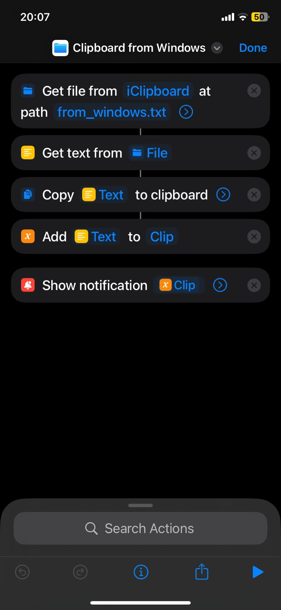

# Windows Continuity (iOS Shortcut)

Personal automation project designed to recreate an Apple-like continuity experience between a Windows PC and an iPhone.

---

## Problem

When working across Windows and iPhone, simple actions such as transferring text, links, or short notes between devices usually involve unnecessary friction: messaging apps, emails, cloud notes, or manual copy–paste workarounds.

Coming from the Apple ecosystem, I missed the native Continuity experience available between macOS and iOS, where information flows naturally and almost invisibly between devices.

The challenge was to recreate this *experience* in a Windows-based workflow, using lightweight tools and without relying on paid or complex third-party solutions.

---

## Solution

This project combines iOS Shortcuts, iCloud Drive, and a small Windows-side automation layer to create a fast, intentional, and low-friction continuity-like experience between Windows and iPhone.

The solution focuses on minimizing interaction cost and cognitive load, allowing text copied on Windows to become immediately available on the iPhone clipboard.

---

## How it works

The solution is intentionally split into two simple and independent parts: Windows and iPhone.

---

## Windows side

On Windows, the continuity experience is enabled through a minimal automation layer built with AutoHotkey and PowerShell.

### Flow overview

1. The user copies text normally using **Ctrl + C**.  
2. Pressing **Ctrl + Shift + C** signals that the current clipboard content should be sent to the iPhone.  
3. An AutoHotkey script intercepts this shortcut and silently launches a PowerShell process in the background.  
4. The PowerShell script reads the current Windows clipboard content and writes it to iCloud Drive at: iCloud Drive / iClipboard / from_windows.txt

5. This file acts as the handoff point between Windows and iPhone.  
6. iCloud automatically syncs the file, propagating the clipboard content to the user's Apple devices.

The AutoHotkey and PowerShell scripts are intentionally minimal, focused, and transparent, and are included in this repository for inspection and customization.

---

## iPhone side

On the iPhone, the flow is handled entirely by an iOS Shortcut.

The Shortcut is triggered using **Back Tap** (double tap on the back of the device), configured via Accessibility settings.

### Shortcut flow

1. Read the file `from_windows.txt` from iCloud Drive  
2. Extract the text content  
3. Copy the text directly to the iOS clipboard  
4. Display the content using Quick Look as visual confirmation  

This provides immediate feedback that the content is now available and ready to be pasted anywhere on the iPhone.

---

## Screenshots

### Shortcut structure

  

### Clipboard confirmation

  

---

## Design rationale

- No servers or network services  
- No paid tools  
- No persistent background UI  
- Uses native system capabilities  
- Fully customizable and easy to adapt  

The goal is not to replicate Apple Continuity technically, but to recreate the *experience*: fast, invisible, and intentional.

---

## Tools and Technologies

- iOS Shortcuts  
- iCloud Drive  
- Apple Accessibility (Back Tap)  
- Windows  
- AutoHotkey  
- PowerShell  

---

## What I learned

- Designing cross-platform workflows  
- Thinking in terms of user experience rather than tools  
- Reducing friction in everyday operational tasks  
- Leveraging native system capabilities to solve real problems  

---

## Possible improvements

- Support for multiple content types (links, formatted text)  
- Bidirectional flow (iPhone → Windows)  
- Context-aware actions based on clipboard content  
